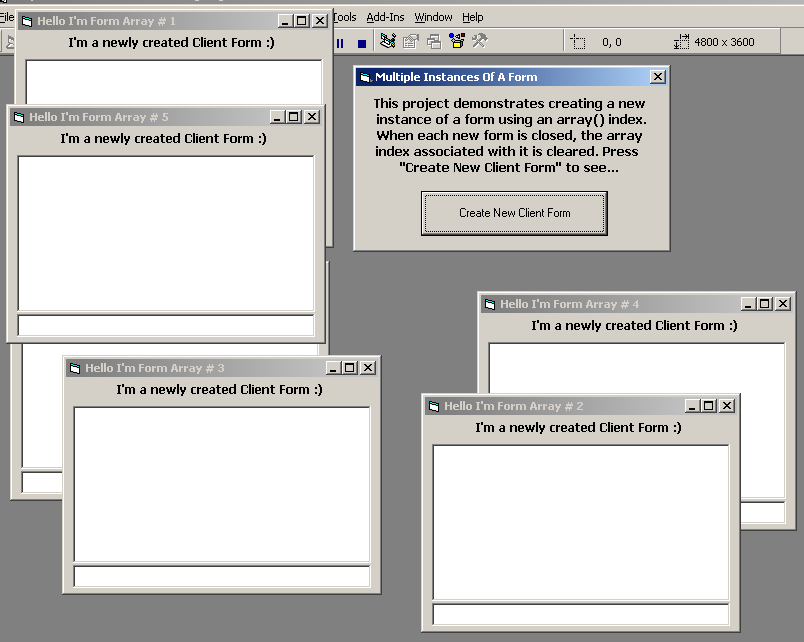



## A Simple Way To Create New Instances Of A Form

### Description

This demonstrates an easy method using and array to create multiple instances of a form for use in anything from a IM client, IRC client, or a data base.
 
### More Info
 

             |
---                |---
**Submitted On**   |2007-02-21 15:40:02
**By**             |[Jason Newland](https://github.com/Planet-Source-Code/PSCIndex/blob/master/ByAuthor/jason-newland.md)
**Level**          |Intermediate
**User Rating**    |4.7 (14 globes from 3 users)
**Compatibility**  |VB 3\.0, VB 4\.0 \(16\-bit\), VB 4\.0 \(32\-bit\), VB 5\.0, VB 6\.0
**Category**       |[Miscellaneous](https://github.com/Planet-Source-Code/PSCIndex/blob/master/ByCategory/miscellaneous__1-1.md)
**World**          |[Visual Basic](https://github.com/Planet-Source-Code/PSCIndex/blob/master/ByWorld/visual-basic.md)
**Archive File**   |[A\_Simple\_W2049242212007\.zip](https://github.com/Planet-Source-Code/jason-newland-a-simple-way-to-create-new-instances-of-a-form__1-67933/archive/master.zip)

### API Declarations

See code

